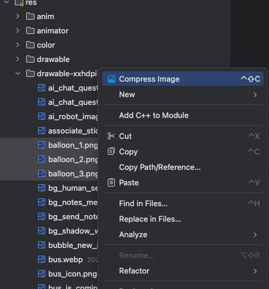
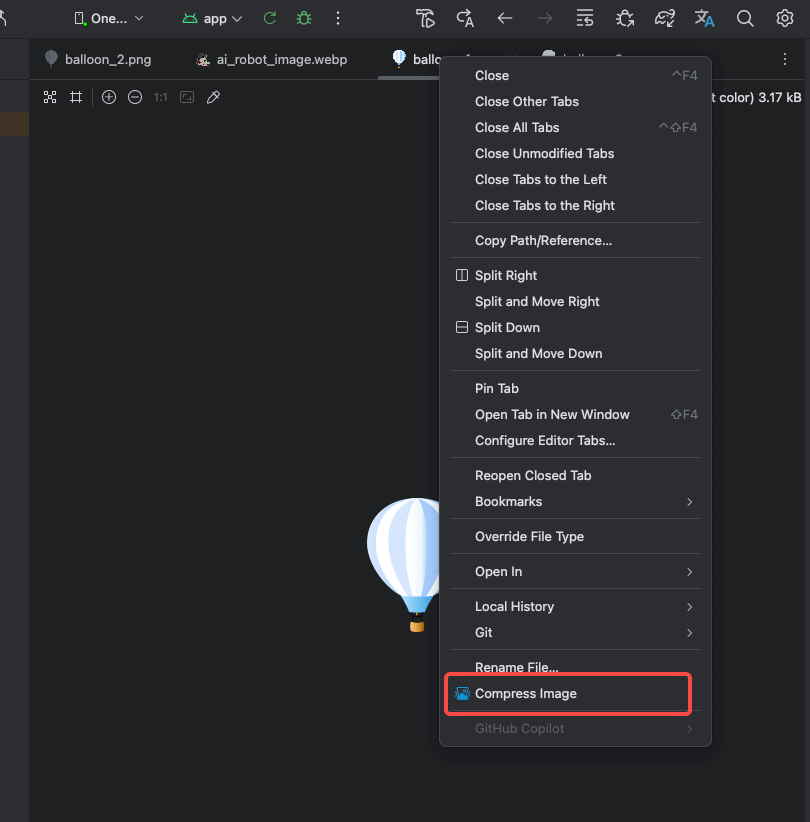

# TinyPngCompressor Plugin

[TinyPngCompressor](https://plugins.jetbrains.com/plugin/27085-tinypngcompressor/) is a Jetbrains plugin that helps developers easily compress images (**webP**/png/jpg/jpeg) directly within the IDE. Powered by [TinyPNG](https://tinypng.com/), the plugin provides a visual interface for compressing images, previewing before/after comparisons, and managing file compression in batch.

## ✨ Features

- ✅ Compress images(**webP**/png/jpg/jpeg) with TinyPNG
- ✅ **Support the latest Android Studio (Meerkat | 2024.3 or newer)** and Intellij IDEA
- ✅ Before/After image preview with compression ratio
- ✅ Batch compression support via project file tree
- ✅ Displays file size reduction and progress
- ✅ Smart filtering to skip already compressed images
- ✅ Easy-to-use, intuitive UI inside your IDE

## 📸 Screenshots





## 🛠 How to Use

1. **Right-click** on a webP/png/jpeg image file or directory in the project view.
2. Select **`Compress Image`** item.
3. The plugin will:
    - Scan and list supported image files.
    - Show original and compressed previews.
    - Compress images via TinyPNG and update size.
4. You can cancel, retry, or skip individual files.


## 📦 Installation

Choose one of the following methods to install the plugin:

### JetBrains Plugin Marketplace (Recommended)

1. Open your JetBrains IDE (IntelliJ IDEA, Android Studio, etc.)
2. Go to **Settings → Plugins → Marketplace**
3. Search for **TinyPngCompressor** 
4. Click **Install**, then restart the IDE

### Manual Installation(Pre-built Zip)

1. Download `TinyPngCompressor-xxx.zip` from [release page](https://github.com/hust-twj/TinyPngCompressor/releases)
2. Go to **Settings → Plugins → ⚙️ → Install Plugin from Disk**
3. Select the `.zip` file above and restart the IDE


### Manual Installation(Build from Source)

1. Clone the project and build the plugin using Gradle:
   ```bash
   ./gradlew buildPlugin
2. Find the output `.zip` file in `build/distributions/`
3. Go to **Settings → Plugins → ⚙️ → Install Plugin from Disk**
4. Select the `.zip` file above and restart the IDE


## 🧱 Project Structure
```declarative
src/
├── main/
│   ├── kotlin/
│   │   └── com/husttwj/imagecompress/  # Main plugin logic
│   └── resources/
│       └── META-INF/plugin.xml         # Plugin descriptor

```

## 🙏 Acknowledgement

Thanks to the [TinyPNG Image Optimizer](https://plugins.jetbrains.com/plugin/11573-tinypng-image-optimizer/reviews) plugin.  
Although it's incompatible with Android Studio Meerkat | 2024.3, its excellent design and functionality served as a valuable reference.
