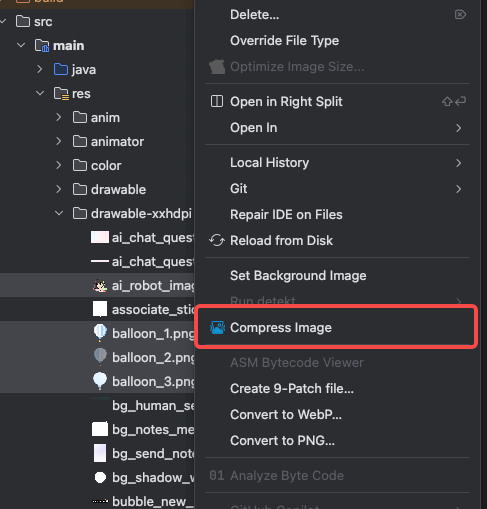

# TinyPngCompress Plugin

**TinyPngCompress** is an Android Studio plugin that helps developers easily compress image files (e.g., PNG, JPEG) directly within the IDE. Powered by [TinyPNG](https://tinypng.com/), the plugin provides a visual interface for compressing images, previewing before/after comparisons, and managing file compression in batch.

## ✨ Features

- ✅ Compress PNG and JPEG images with TinyPNG
- ✅ Compatible with the latest Android Studio (version 2024.3 or newer)
- ✅ Before/After image preview with compression ratio
- ✅ Batch compression support via project file tree
- ✅ Displays file size reduction and progress
- ✅ Smart filtering to skip already compressed images
- ✅ Easy-to-use, intuitive UI inside your IDE

## 📸 Screenshots



## 🛠 How to Use

1. **Right-click** on a png/jpeg image file or directory in the project view.
2. Select **`Compress Image`** item.
3. The plugin will:
    - Scan and list supported image files.
    - Show original and compressed previews.
    - Compress images via TinyPNG and update size.
4. You can cancel, retry, or skip individual files.


## 📦 Installation

### JetBrains Plugin Marketplace

1. Open your JetBrains IDE (IntelliJ IDEA, Android Studio, etc.)
2. Go to **Settings → Plugins → Marketplace**
3. Search for **TinyPngCompressor** 
4. Click **Install**, then restart the IDE

### Manual Installation

1. Clone the project and build the plugin using Gradle:
   ```bash
   ./gradlew buildPlugin
2. Find the output `.zip` file in `build/distributions/`
3. Open IDE → Settings → Plugins → ⚙️ → Install Plugin from Disk
4. Select the `.zip` file and restart the IDE


## 🧱 Project Structure
```declarative
src/
├── main/
│   ├── kotlin/
│   │   └── com/husttwj/imagecompress/  # Main plugin logic
│   └── resources/
│       └── META-INF/plugin.xml         # Plugin descriptor

```

